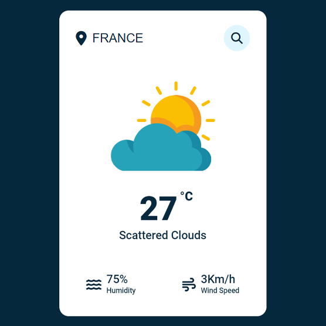

**Name:** MANIKANDAN.R  
**Company:** CODTECH IT SOLUTIONS  
**ID:** CT08DS7780  
**Domain:** Frontend Development  
**Duration:** August 30th, 2024 to September 30th, 2024  

## Overview of the project

### Weather App
In this task  I am gonna showing to you how to code a weather app with javascript. in this task also we use a weather api and we get data from api.

### Technologies Used
1. HTML for markup
2. CSS for styling
3. JavaScript for Scripting and get the Weather API

# Screenshot
Here we have project screenshot :

